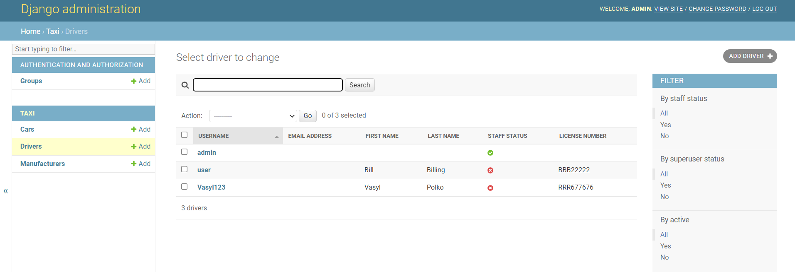

#Taxi-service

Taxi project for managing drivers and cars in taxi-service

## Check it out!

[Taxi project deployed to Heroku](PASTE_LINK_HERE)

## Installation

Python3 must be already installed

```shell
git clone https://github.com/serhii56465/taxi-service.git
cd taxi-service
python3 -m venv venv
source venv/bin/activate
pip install -r requirements.txt
python manage.py runserver # starts Django Server
```

## Features

* Authentication functionality for Driver/User
* Managing cars drivers @ manufacturers directly from website
* Powerful admin panel for advanced managing

## Demo




